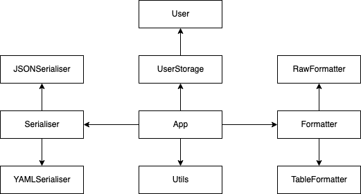

# User Storage App

An application for storing, saving, loading, and dispalying user data. 

#### Contents
- [User Storage App](#user-storage-app)
      - [Contents](#contents)
  - [1. Introduction](#1-introduction)
    - [1.1 Setup](#11-setup)
    - [1.2 Basic Usage](#12-basic-usage)
  - [2. Challenges](#2-challenges)
  - [3. API Overview](#3-api-overview)
    - [3.1 App](#31-app)
    - [3.2 UserStorage](#32-userstorage)
    - [3.3 Serialisation](#33-serialisation)
    - [3.4 Formatting](#34-formatting)
  - [App Architecture](#app-architecture)
  - [4. Dependencies](#4-dependencies)

## 1. Introduction

The `UserStorage` app is comprised of two primary components: the `UserStorage` and `App` classes. The `UserStorage` class is an object with an integrated API which handles the creation, addition, serialisation, and formatting of user data. The `App` class, on the other hand, is a CLI application which provides a user-friendly interface to `UserStorage`. 

### 1.1 Setup

1. Clone the repository (or download the source code): `git clone https://github.com/Raelr/python-sandbox.git`
2. Install dependencies ([`tabulate`](https://pypi.org/project/tabulate/) and [`PyYaml`](https://pyyaml.org/wiki/PyYAMLDocumentation)):
   1. `$ pip install tabulate`
   2. `$ pip install pyyaml`
3. Navigate to the `user_storage/src` directory.
4. Run `Python3 main.py`
5. Enjoy!

### 1.2 Basic Usage

The CLI app has the following features:

1. `Add User` - Adds a user after inputting a name, address, and phone number. 
2. `Filter Users` - Allows users to be filtered using [`Glob`](https://en.wikipedia.org/wiki/Glob_(programming)) syntax. This returns data in four formats: `JSON`, `YAML`, `Table` and `Raw`.
3. `Save Users` - Saves users to a `JSON` or `YAML` file.
4. `Load Users` - Loads users from a `JSON` or `YAML` file and populates the storage. 
5. `Show Available Formats` - Displays all available formats.

## 2. Challenges

The main challenges that were anticipated when creating this API are summarised below:

* <b>Finding the correct packages:</b> Python has a myriad of different modules which can be used to automate certain processes. Finding the right one is a time consuming and somewhat overwhelming process at times. This was overcome by sticking to a simple rule: where possible, use official Python packages. 
* <b>Working out what should be custom made, and what should be imported:</b> Since Python does have such a large variety of content, it's often hard to know what you need to write, and what you can just import. The decision was eventually made to custom build all modules that require application-specific logic. For example, the actual `UserStorage` object would need my own custom logic, but a `YAML` parser, which is complex beyond the scope of the project, would be imported. 
* <b>Separating code into Modules:</b> Separating responsibilities between every module would prove to be an interesting problem to solve. In theory, the `UserStorage` object could handle all logic, but this would make the class incredibly large and complex. 
     * A decision was eventually made to separate the modules into four primary modules: `UserStorage`, `App`, `Serialisation` and `Formatting`. Each of these would handle their specific tasks and would be combined within the CLI application.

## 3. API Overview

Overall, the main application is split into 4 modules: `UserStorage`, `App` `Serialisation` and `Formatting`. Each of these have their own API which, combined, creates the overall UserStorage Application. A brief description of each module can be found below:

### 3.1 App

The `App` module dictates how the CLI application will work. The primary methods for this module are as follows:

* `App()` - The App's constructor. It takes no external parameters.

* `run()` - The main entrypoint for the application.

### 3.2 UserStorage

The `UserStorage` module contains all logic for storing and filtering users. it contains the following:

* `UserStorage()` - Constructor: Takes no external parameters. 

* `add_user(name, address, phone)` - Adds a user to the collection. Take 3 parameters, a name, address, and a phone number.
* `filter_users(command)` - Filters user based on a given Glob filter command. Note that all users are formated as follows: `'Name: <name> | Address: <address> | Phone: <phone>'`. Any requests made must take this format into account. 
  * <b>Example:</b> Searching for all users named `albert` could be achieved with queries such as: `Name:Albert*`, `Name: Albert*`, and `*Albert*`. 
* `clear_users()` - Clears the storage of all users.
* `get_all_users()` - Returns an array of all users.
* `search_user(user)`  - Returns `True` if a user exists in the current list. 

### 3.3 Serialisation

The `Serialisation` module handles all serialisation. Currently, the serialiser can serialise data to both `JSON` and `YAML`. It does so with the following methods: 

* `Serialiser()` - Constructor: Takes no external parameters. 
* `serialise(data, data_format)` - Serialises data to a specified format (`YAML` or `JSON`)
* `deserialise(data, data_format)` - De-serialises either `JSON` or `YAML` data to a list.
* `is_supported(data_format)` - Returns `True` if a format is supported by the Serialiser.
* `get_supported_formats()` - Returns a list of all supported formats. 

### 3.4 Formatting

The `Formatting` module handles all data formatting needed to return queries to users. The formatter is currently able to format data in a table, or return it in a raw array format. The formatter formats data using the following methods:

* `Formatter()` - Constructor: Takes no external parameters. 
* `format_data(data, headers, data_format)` - Formats data and returns it either in a `table` or in a raw format. 
* `is_supported(data_format)` - Return `True` if a format is supported.
* `get_supported_formats()` - Returns a list of supported formats
* `format_list(data)` - Takes a list of data and formats it sequentially.

## App Architecture

The App's architecure can be visualsed as follows:

## 4. Dependencies

This project depends on the following modules and libraries:

* [`PyYaml`](https://pyyaml.org/wiki/PyYAMLDocumentation)
* [`tabulate`](https://pypi.org/project/tabulate/)
* `fnmatch`
* `json`
* `os`
* `unittest`